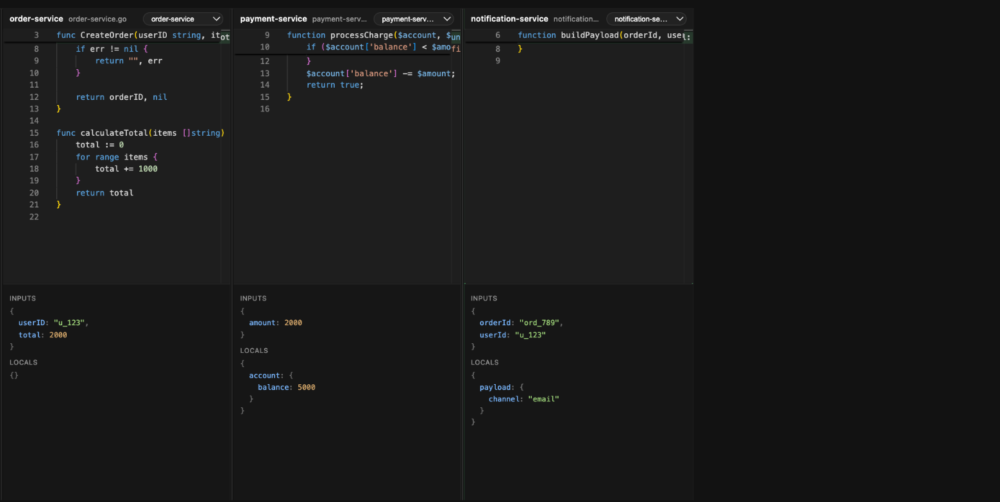
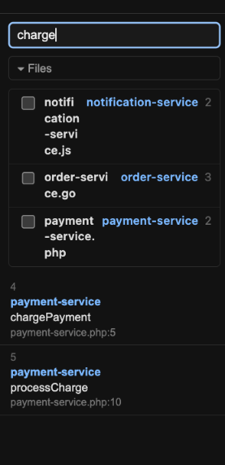
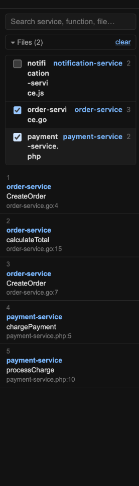

# Traceweave

A time-travel debugger for distributed systems: capture what your real services actually did
while handling a request — every function, its file/line, its params — across as many
services as you're running, with **zero source edits**, then step through it afterwards in a
web UI. No breakpoints, no paused processes; your services keep running normally.

Currently supports **Node.js** and **PHP** services. See [SPEC.md](SPEC.md) for the original
design spec this was built from (some details there — Go support, W3C trace headers — didn't
end up matching what was actually built).

## What it does

- **Auto-instruments your code at load time.** Point it at a project folder and start it
  through the UI (or load the capture SDK yourself) — every function call gets a recorded
  step (file, line, function name, params) with no edits to your source.
- **Merges traces across services.** One request that flows through several services (e.g.
  a Node middleware calling a PHP backend calling another Node payment service) shows up as
  a single steppable trace, in the order things actually happened, not one trace per service.
- **Renders each service in its own pane.** A multi-pane UI shows the current line of code,
  its inputs/locals, per service — so you can see the same request as it moves through your
  whole system, not just one process at a time.
- **Runs your dev commands for you.** Register a project's folder and run command from the
  UI (`▶ Start`/`■ Stop`), and it injects the capture SDK into that process automatically —
  you never touch `NODE_OPTIONS` or PHP's `-d` flags by hand.



## How it works

1. **Capture.** A small SDK loaded alongside your app instruments it as it runs:
   - **Node** (`sdk/node`): a module hook rewrites your files' functions at load time to
     call a recording function, using the TypeScript compiler API — no build step, no
     source changes on disk.
   - **PHP** (`sdk/php`): a `stream_wrapper` intercepts `include`/`require` and does the same
     transform with `nikic/php-parser`, delivered via `-d auto_prepend_file`.
2. **Propagate.** The first service in a flow generates a `traceId`; it's passed to
   downstream services via an `x-ttd-trace-id` HTTP header (attached automatically for Node's
   outgoing `fetch`/`http.request`/`http.get`; PHP needs one line at the outgoing call site,
   since PHP has no equivalent zero-edit hook for curl-based clients like Guzzle).
3. **Ingest.** Each service buffers its own steps and flushes them to the backend
   (`POST /api/traces`) as the request finishes. The backend merges steps sharing a `traceId`
   into one trace, sorted by timestamp.
4. **Watch live / step back.** The backend pushes new traces to the frontend over
   WebSockets. Pick a trace, then step forward/backward (or jump via the searchable,
   filterable step list) through the merged timeline — each pane shows the real source file,
   highlights the active line, and displays that step's captured inputs/locals.

## Getting started

```bash
make install   # npm install in both + seed .env files
make dev       # runs backend (:4000 by default) and frontend (:5173) together, Ctrl+C stops both
make stop      # safety net if a previous `make dev` didn't shut down cleanly
```

Or run each independently:

```bash
cd backend && npm install && npm run dev   # tsx watch, listens on :4000
cd frontend && npm install && npm run dev  # vite dev server, :5173 (or next free port)
```

Open the frontend URL, then:

1. **Add your projects.** Use the **Projects** bar (`+ Add project`) to register any number
   of local folders — browse, filter, or paste an absolute path directly.
2. **Give it a run command** (optional, e.g. `npm run dev` or `php artisan serve`). This
   gets you a ▶ Start button, live stdout/stderr, and automatic capture-SDK injection — no
   manual env vars needed. Rename a project or edit its run command anytime (the command
   only while it's stopped); click its status dot for logs.
3. **Trigger a real request** against your running services (curl, Postman, your own
   client). A new trace shows up in the UI automatically as it's captured. (No real services
   handy yet? `make mock-trace` posts a small fake cross-service trace so you can try the UI
   immediately — that's what the screenshots below are from.)
4. **Step through it.** Use Prev/Next, the trace picker, or the step list on the left —
   search by service/function/file, or check off specific files to only show their steps.
   Each service's pane updates to show its current line, inputs, and locals as you step.

   | Search the step list | Filter to specific files |
   | --- | --- |
   |  |  |

Want to wire up capture manually instead of through the UI's process orchestration? See the
SDK docs: [`sdk/node/README.md`](sdk/node/README.md) (zero-edit hook, manual `recordStep()`
API, live logpoint breakpoints) and [`sdk/php`](sdk/php) (stream-wrapper instrumentation,
`Recorder::currentTraceId()` for propagating traces across an outgoing PHP HTTP call).

Other useful scripts: `npm run typecheck` (both), `npm run build` (backend emits to `dist/`
via `tsc`; frontend typechecks then runs `vite build`), `make mock-trace` (backend) for a
quick smoke test with fake trace data instead of a real running service.
